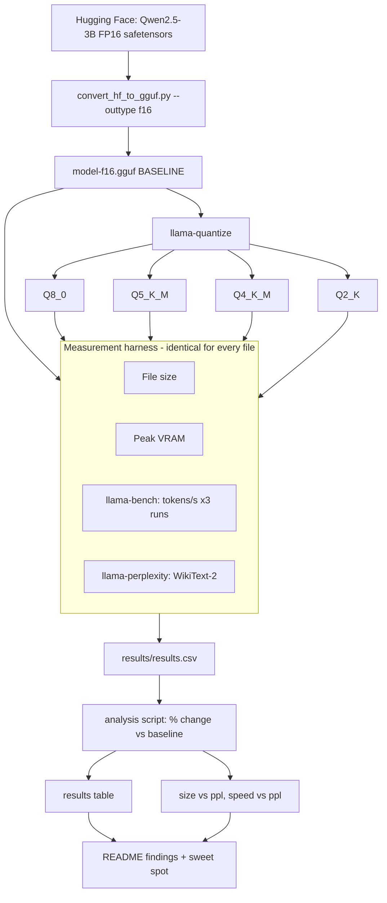

# System Architecture

This project is a measurement pipeline, not a running service. "Architecture" here means the flow of artifacts and the measurement contract.

## Pipeline Flow


## Repo Layout (planned)
```text
llm-benchmarker/
  README.md
  results/
    lab_notebook.txt   # raw commands + output
    results.csv        # one row per model file
    charts/
  scripts/             # analysis/plotting
  models/              # GGUF files (gitignored)
```

## Results Data Contract (`results/results.csv`)
- `model`: string (e.g. `qwen2.5-3b`)
- `quant`: string (`F16`, `Q8_0`, `Q5_K_M`, `Q4_K_M`, `Q2_K`)
- `size_gb`: float
- `peak_vram_gb`: float
- `tokens_per_s_mean`: float, `tokens_per_s_std`: float (3 runs)
- `perplexity`: float
- Percent-change columns vs. baseline are derived in the analysis step, not stored by hand.
- TODO (user decision): add columns for prompt-processing speed (`pp512`) separately from generation (`tg128`).

## Extension: 14B
Same pipeline, but baseline is Q6_K (FP16 won't fit in 16 GB). The README must state this; percent changes are relative to Q6_K, not FP16, so they are not comparable with the 3B table.
