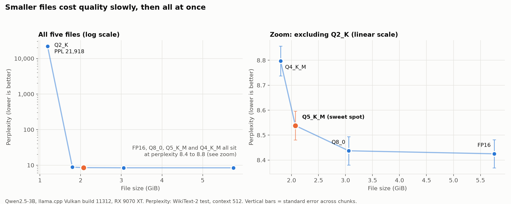
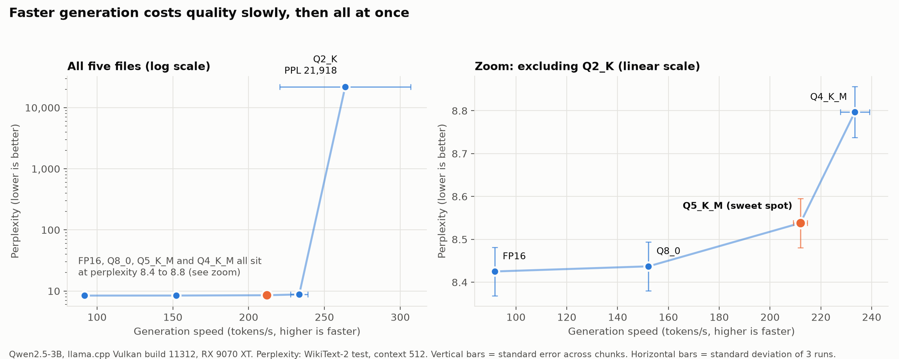

# llm-benchmarker

> A controlled experiment measuring what quantization costs a local LLM in quality and what it buys in memory and speed.

## Overview & Goal
Quantization stores a model's weights in fewer bits (8, 5, 4, 2 instead of 16). This project measures, on one machine with one methodology, how much that shrinks the model and what it costs in speed and quality.
- **Main goal:** Quantify the size / speed / quality tradeoff of quantization.
- **Practical goal:** Find the best quantization level for running a larger model on a 16 GB GPU.
- **Resume goal:** A reproducible repo with a results table, charts, and an honest write-up.

## Hypothesis
> Q4_K_M will cut model size by about 70% with under 20% perplexity increase. The 70% decrease comes from 4.85/16 which is about .3, where 4.85 is the the bits per weight, and 16 is the
> old bits per weight.  The perplexity increase comes from the jump from FP16 to Q4_K_M. Since much of the computing power is lost from this jump, its easy to hypothesize that the
> post quantized model will not hold up to the original.

Result vs. hypothesis is reported in Findings once the runs are done.

## Method
- **Baseline (before):** Qwen2.5-3B at FP16 (GGUF `f16`).
- **Quantized (after):** Q8_0, Q5_K_M, Q4_K_M, Q2_K from the same FP16 file.
- **Metrics:** file size, peak VRAM, tokens/s (llama-bench, 3 runs averaged), perplexity (WikiText-2 test set).
- **Controls:** same machine, same flags, same prompts, nothing else on the GPU.
- **Extension:** 14B model with Q6_K as the baseline (FP16 doesn't fit) vs. Q5_K_M, Q4_K_M, Q3_K_M.

## Sanity Check: Baseline Sample Output
Informal check that the FP16 GGUF loads and generates coherent text on the GPU. This is **not** benchmark data: sampling was at llama.cpp's default (temperature 0.8), so output varies from run to run, and Qwen2.5-3B is a base model (it continues text rather than answering as an assistant).

**Command:**
```
llama-completion.exe -m models\qwen2.5-3b-f16.gguf -ngl 99 -p "The top reasons why macos is better than windows is" -n 100 -no-cnv
```

**FP16 output** (the model repeats the prompt, then continues it):
> The top reasons why macos is better than windows is that macos has the ability to protect you from malware, viruses, and other viruses that windows cannot. Also, macos is the most secure operating system in the world.
> There are some reasons why macos is better than windows and some reasons why it is not. There is no right or wrong answer. The best OS for you is the one that works best for you. In this blog post, we’ll explore some of the reasons why macOS might be better than Windows. Let’s get started

**Observations:** The model continues the prompt like the start of a blog post instead of answering directly (expected for a base model), and its claims are generic and partly wrong or repetitive ("viruses ... other viruses"). Useful as a qualitative reference to compare against the quantized versions later.

## Results
All five files are measured with `scripts/benchmark_all.ps1` (one run per file, same session and settings). Perplexity is `llama-perplexity` on the WikiText-2 test set with default settings (context 512, 584 chunks); the ± is the standard error across chunks. Peak VRAM is the rise above the idle baseline during `llama-bench` (`scripts/measure_vram.ps1`), so it includes weights plus KV cache and compute buffers. Raw numbers are in `results/results.csv`; raw tool output is in `results/logs/`. Charts land in `results/charts/`.

Speed is mean ± standard deviation across repeated `llama-bench` runs, in tokens/s. `pp512` = prompt processing (512 tokens), `tg128` = token generation (128 tokens). Sizes are GiB (2^30 bytes). Δ speed is computed on `tg128`; Δ VRAM compares the VRAM cost (peak minus idle). Δ perplexity is relative to FP16 (lower perplexity is better, so positive = worse).

| Precision | Size (GiB) | Peak VRAM (GiB) | pp512 (t/s) | tg128 (t/s) | Perplexity | Δ size | Δ VRAM | Δ speed (tg128) | Δ perplexity |
|---|---|---|---|---|---|---|---|---|---|
| F16       | 5.75 | 6.18 | 6,296 ± 427 | 91.64 ± 0.45 | 8.4251 ± 0.0567 | - | - | - | - |
| Q8_0      | 3.06 | 3.49 | 7,004 ± 553 | 152.17 ± 1.21 | 8.4371 ± 0.0568 | -46.8% | -43.5% | +66.1% | +0.1% |
| Q5_K_M    | 2.07 | 2.51 | 5,026 ± 1,834 | 211.93 ± 2.79 | 8.5380 ± 0.0576 | -64.0% | -59.4% | +131.3% | +1.3% |
| Q4_K_M    | 1.80 | 2.22 | 5,972 ± 615 | 233.37 ± 5.73 | 8.7968 ± 0.0596 | -68.8% | -64.1% | +154.7% | +4.4% |
| Q2_K      | 1.19 | 1.62 | 4,234 ± 18 | 263.69 ± 43.09 | 21,918 ± 209 | -79.4% | -73.8% | +187.7% | +260,054% |

Notes:
- **Baseline re-run:** the FP16 row is the baseline re-measured in the same session as the quantized files (an earlier run on 2026-10-03 gave 91.6 to 92.5 t/s generation, 6.20 GiB VRAM, and the identical perplexity 8.4251, which shows perplexity is deterministic). See `results/lab_notebook.txt` for both.
- **Q2_K is broken, not just degraded:** perplexity 21,918 means the model produces garbage (e.g. "The capital of France is" continues with a stream of punctuation). The same garbage appears with `-ngl 0` (CPU only), so it is the quantized model, not a GPU-backend bug.
- **Speed noise:** `pp512` varies a lot between runs (±1,834 on Q5_K_M, ±427 to ±615 elsewhere), so differences in prompt-processing speed between files are not reliable from this data. `tg128` is much more stable except for Q2_K (±43).
- **Background load:** other programs were using the GPU (idle VRAM about 2.9 to 3.0 GiB in these runs versus 1.1 to 1.4 GiB earlier), which is a limitation on the controls. VRAM cost is computed as peak minus idle, which removes the steady background use.

## Charts




Each chart has two panels because Q2_K's perplexity (21,918) is about 2,600x the baseline's: the left panel shows all five files on a log axis so the collapse is visible, and the right panel zooms in on the four usable files on a linear axis so the real tradeoff is visible. Q5_K_M (orange) is the chosen sweet spot. Regenerate with `python scripts/make_charts.py`. The perplexity error bars are each file's own standard error across chunks, and several overlap (Q8_0 vs. Q5_K_M, for example), so small perplexity gaps between neighboring files are suggestive, not tested for significance.

## Findings
- **Hypothesis: confirmed.** Q4_K_M cut file size by 68.8% (predicted about 70%) with a 4.4% perplexity increase (predicted under 20%). The 20% threshold turned out loose; the real loss was a fifth of it.
- **Sweet spot: Q5_K_M.** It uses 2.51 GiB of VRAM (59% less than FP16) for a 1.3% perplexity increase, and generates about 2.3x faster than FP16. The reasons, in order: VRAM cost and perplexity change. Stepping down from Q8_0 to Q5_K_M saves 0.98 GiB for 1.2 points of perplexity; stepping further to Q4_K_M saves only 0.29 GiB more for 3.1 more points, so the quality cost per GiB saved is about 2.5x worse.
- **Q4_K_M is the runner-up** if memory is the tightest constraint; it is still within about 4% of FP16 quality.
- **Q2_K is unusable.** Perplexity rose to 21,918 and the model generates garbage, on both GPU and CPU.
- **Speed:** token generation speed rises steadily as files shrink (91.6 t/s at FP16 up to 233 t/s at Q4_K_M), because generation is limited by how fast weights can be read from memory. The gain is smaller than the size reduction, so it is not purely proportional.
- **Open question:** on a 16 GB GPU the 3B model fits at every level, so this sweet spot is about efficiency. Which level is best for the largest model that fits is tested by the 14B extension.

## Limitations
TODO after results (single machine, single model family, single perplexity dataset, etc.).

## How to Reproduce
See `PROJECT_SPEC.md` for the exact commands and settings.

## Tech Stack
llama.cpp (Vulkan/ROCm build), GGUF, Hugging Face, Python (matplotlib/pandas for charts).

## Personal Learning Objectives
- Design a controlled experiment with a pre-registered hypothesis.
- Understand GGUF, quantization schemes (Q8_0 vs K-quants), and perplexity as a quality proxy.
- Benchmark inference correctly (GPU offload, repeated runs, controlled environment).
- Communicate results honestly with a table, charts, and stated limitations.
